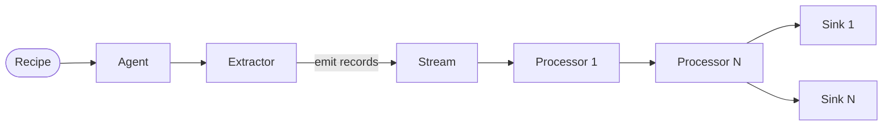

Meteor collects metadata from data sources and delivers it to destinations. Every metadata collection job is defined by a **recipe** — a YAML file that wires together one extractor, zero or more processors, and one or more sinks.

## Architecture

The core data path in Meteor is a pipeline: an extractor emits records into a stream, each processor transforms those records in sequence, and every sink consumes the final records and delivers them to a destination.



The **Agent** is the runtime that reads a recipe, initialises each plugin, and orchestrates the pipeline. When you run `meteor run recipe.yaml`, the agent:

1. Loads the extractor named in `source` from the plugin registry.
2. Loads each processor listed in `processors` and chains them as stream middleware.
3. Loads each sink listed in `sinks` and subscribes them to the stream.
4. Calls `Extract` on the extractor in a goroutine; records flow through the stream to all processors and sinks concurrently.

<Note>
Each recipe has exactly **one** source. If you need to extract from multiple sources, create a separate recipe for each and run them together with `meteor run <directory>`.
</Note>

## Components

<CardGroup cols={2}>
  <Card title="Recipe" icon="file-lines" href="/concepts/recipe">
    A YAML file that defines a complete metadata extraction job — source, processors, and sinks in one place.
  </Card>
  <Card title="Extractors" icon="database" href="/concepts/extractors">
    Plugins that connect to a data source (Kafka, BigQuery, MongoDB, …) and emit structured metadata records.
  </Card>
  <Card title="Processors" icon="gears" href="/concepts/processors">
    Plugins that transform, enrich, or filter records as they flow through the stream.
  </Card>
  <Card title="Sinks" icon="arrow-right-to-bracket" href="/concepts/sinks">
    Plugins that receive the final records and deliver them to a destination (HTTP, Kafka, GCS, …).
  </Card>
</CardGroup>

## Plugin types

Meteor defines three plugin types in `plugins/plugin.go`:

| Type | Interface | Role |
|------|-----------|------|
| `extractor` | `Extractor` | Reads metadata from a source and emits `models.Record` values |
| `processor` | `Processor` | Receives one record, transforms it, and returns the result |
| `sink` | `Syncer` | Receives a batch of records and writes them to a destination |

All plugin types embed the base `Plugin` interface, which provides lifecycle methods (`Info`, `Validate`, `Init`) that the agent calls before running each plugin.

## Execution model

<Steps>
  <Step title="Recipe is parsed">
    Meteor reads and validates the YAML recipe. Dynamic template variables (environment variables prefixed with `METEOR_`, or values from a `--var` file) are substituted using Go's `text/template` engine.
  </Step>
  <Step title="Plugins are initialised">
    The agent calls `Validate` then `Init` on the extractor, each processor, and each sink in order. This is where plugins open connections, authenticate, and check required config fields.
  </Step>
  <Step title="Extraction runs">
    The agent launches the extractor in a goroutine. The extractor calls the `emit` function for each record it produces. Records are pushed into an internal stream.
  </Step>
  <Step title="Records flow through processors">
    Each processor is registered as stream middleware. Records pass through processors **sequentially**, one processor at a time, in the order they appear in the recipe.
  </Step>
  <Step title="Sinks receive records">
    Sinks are registered as stream subscribers. Each sink receives records in batches. Multiple sinks run concurrently — the same record batch is delivered to all sinks.
  </Step>
  <Step title="Cleanup">
    After the extractor finishes, the stream shuts down. The agent calls `Close` on each sink, logs duration and record count, and returns the run result.
  </Step>
</Steps>

## Multiple recipes

You can run all recipes in a directory in a single command. The agent runs each recipe in its own goroutine:

```bash
meteor run ./recipes/
```

Recipes within a directory run concurrently. Each recipe is fully isolated — they do not share extractors, processors, or sinks.
